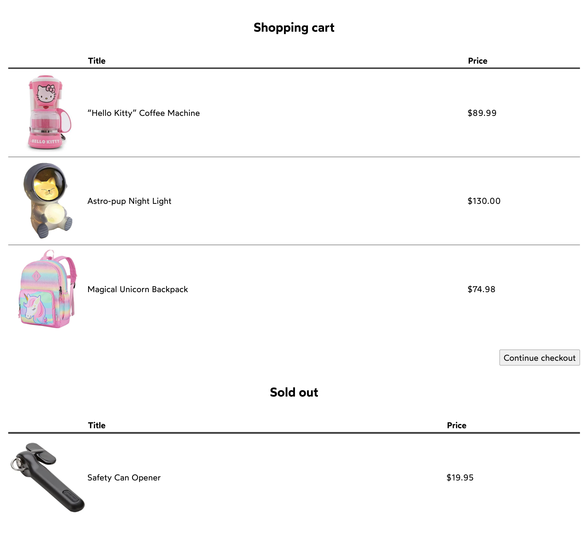

# Iteration

## Avatars

We have an application which displays multiple avatars the user can select from.

The Avatar component is already wired up, but it's being rendered manually, copy/pasted with different data.

- You should create an array that holds the data needed for all avatars.
- That array should be iterated over ( .map), creating an <Avatar /> element for each item in the array.
- There should be no key warnings in the console.

---

## Shopping cart

We're building a shopping cart UI. We receive an array of items being held in the cart from the server.

Sometimes, an item in the user's shopping cart will be out of stock. If the item is out of stock, they can't purchase it. And so it should be displayed separately.

We've started working on it, but two problems remain:

- We need to show all of the items in the user's shopping cart, not just the first one.
- We need to show two separate tables. One for the in-stock items, one for the sold-out items. Use `Array.filter` to create two data sets.

Acceptance criteria:

Update the CartTable component (in the second file) to use iteration.

- Make sure that there are no key warnings in the console.
- We should be rendering two CartTable elements:

1. One for the “in stock” elements, in the current spot
2. One for the “out of stock” elements, below the “Sold Out” heading.
